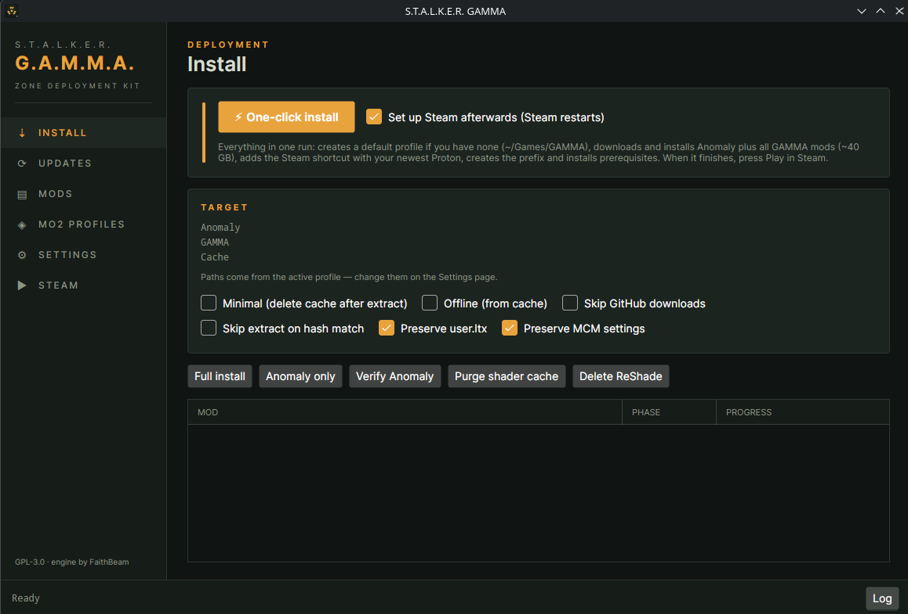

# Stalker GAMMA Linux GUI

An all-in-one Linux desktop app (Avalonia, .NET 10) to download, install, update, and play
[S.T.A.L.K.E.R. G.A.M.M.A.](https://stalker-gamma.com) on Linux — built for Arch/CachyOS.



Features:
- Full install of Anomaly + GAMMA (engine vendored from
  [FaithBeam/stalker-gamma-cli](https://github.com/FaithBeam/stalker-gamma-cli), see `VENDORED.md`)
- Update check/apply, MO2 mod enable/disable/delete, MO2 profile management
- Config profiles shared with the upstream CLI (`~/.config/stalker-gamma/settings.json`)
- Steam integration: adds a non-Steam shortcut for Mod Organizer 2, auto-selects the newest
  installed Proton-CachyOS/Proton-GE, creates the Proton prefix, and installs prerequisites
  via protontricks
- Ships as a single self-contained AppImage

## Build

```sh
dotnet build                                   # debug build
scripts/setup-deps.sh src/StalkerGamma.Gui/bin/Debug/net10.0   # fetch 7zz/libcurl-impersonate/cacert
dotnet run --project src/StalkerGamma.Gui
```

## AppImage

```sh
scripts/build-appimage.sh    # produces StalkerGammaGui-x86_64.AppImage
```

License: GPL-3.0 (see `LICENSE`).
